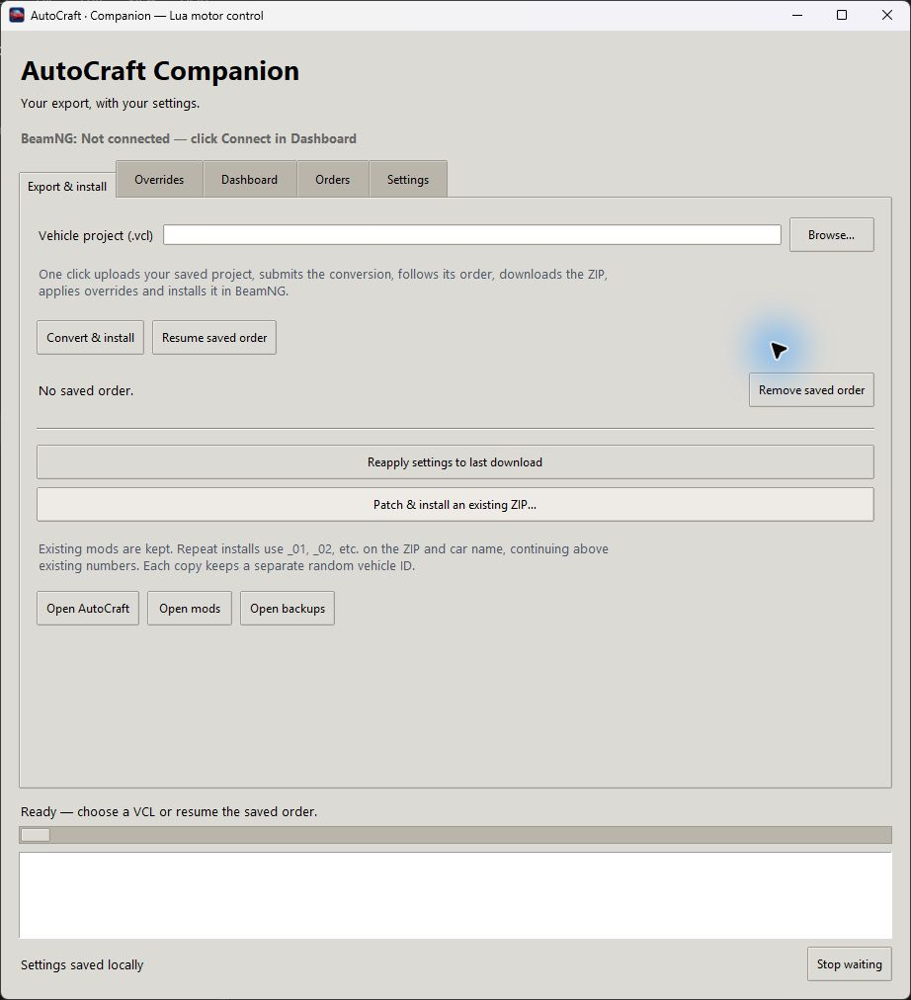
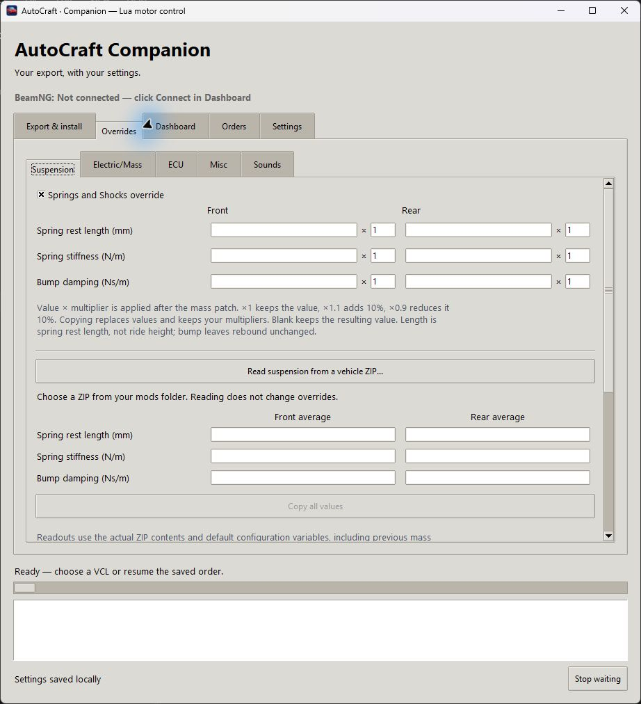
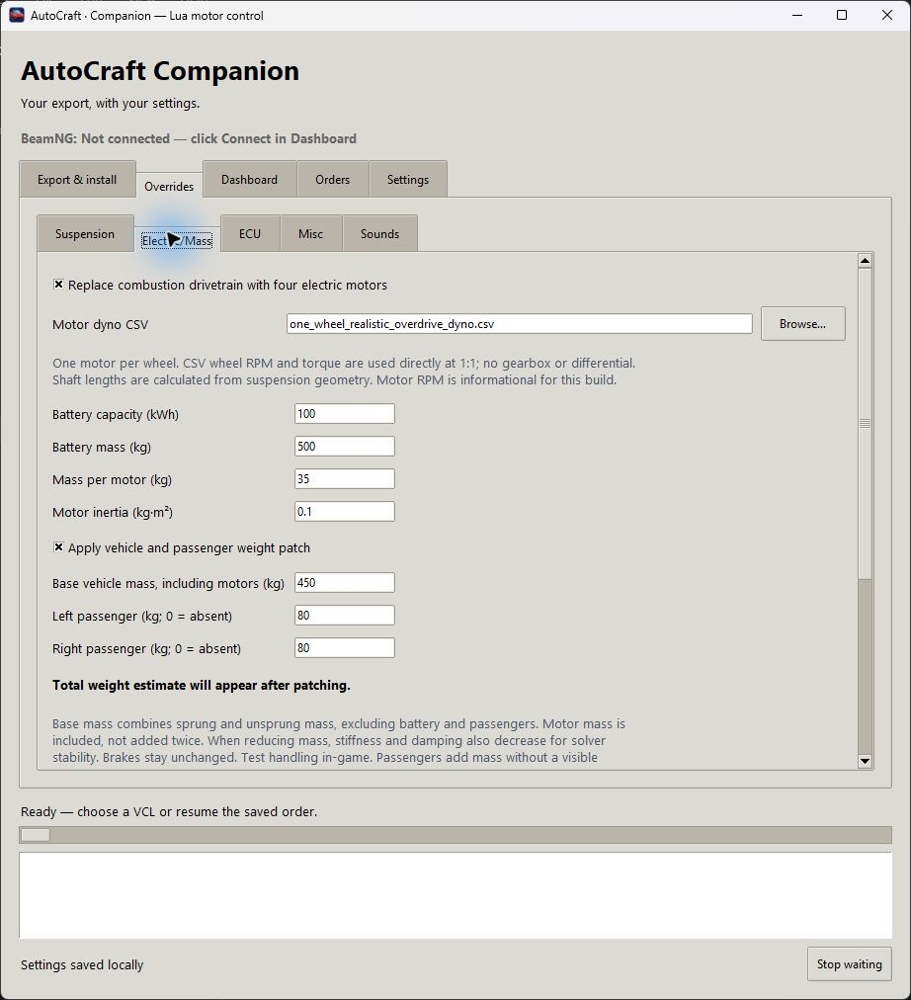
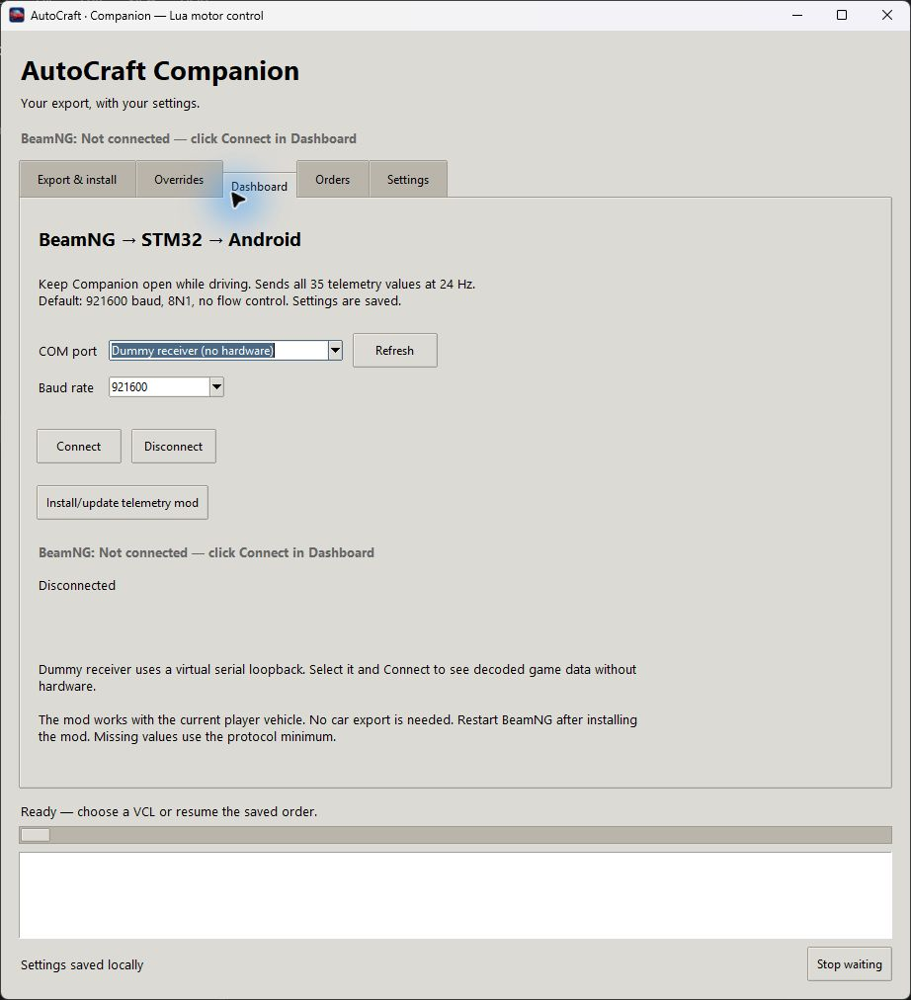

# AutoCraft Companion v0.2.0

A Windows desktop app for exporting AutoCraft cars to BeamNG, applying custom patches, and sending dashboard telemetry to an STM32.

## Screenshots

| Export & install | Springs and shocks |
| --- | --- |
|  |  |

| Electric/Mass | Dashboard |
| --- | --- |
|  |  |

## Setup

The [Windows release](https://github.com/MihiOr/autocraft-companion/releases/latest) includes the compiled launcher, Python/Lua source, setup scripts and ten BeamNG helper mod ZIPs. Install Python 3.11 or newer with Tkinter, extract the package, run `setup.ps1`, then open **AutoCraft Companion.exe**. The EXE launches the Python app; Python is still required.

To run from a source checkout:

Install Python 3.11 or newer with Tkinter, then run these commands from the repository folder:

```powershell
python -m venv .venv
.\.venv\Scripts\python.exe -m pip install -r requirements.txt
.\.venv\Scripts\python.exe src/app.py
```

`setup.ps1` runs the first two steps. `Start Companion.vbs` opens the app without a console window. To build the taskbar launcher, run `tools/build_launcher.ps1`. Keep the resulting `AutoCraft Companion.exe` beside the `src/` folder and pin it to the taskbar.

In **Settings**, choose your BeamNG mods folder. Enter your own Delta Cross login if you want website conversions. Offline patching and dashboard telemetry work without an account.

The app creates `src/settings.json` on first use. It saves paths, overrides, conversion state and any login you enter. That file is local and ignored by Git. The repo contains only an empty settings example.

## Exporting a car

1. Save the car as a `.vcl` in AutoCraft.
2. Select it in **Export & install** and set your overrides.
3. Click **Convert & install**. Companion uploads the project to Delta Cross, submits the conversion, waits for its order, downloads the ZIP and installs a patched copy.
4. Refresh the vehicle selector and load the new copy in BeamNG.

**Resume saved order** continues an existing conversion. **Reapply settings to last download** patches the original download again. **Patch & install an existing ZIP** works offline. Repeated installs get numbered names instead of replacing an existing mod.

The **Orders** tab lists website orders and lets you delete a selected order. Removing the local saved order only clears the resume record.

## Overrides

- **Suspension:** spring lengths, stiffness and bump damping; per-field multipliers; reading and copying front/rear averages from another ZIP; kingpin stops and steering response.
- **Electric/Mass:** four direct-drive motors, a CSV torque curve, simulated ratio changes, battery settings, vehicle mass and passenger mass.
- **ECU:** edit `src/custom_motor_control.lua` and check it before exporting. It controls each motor's commanded torque, using the Interpreter → TRC → MiTVS pipeline. TRC searches for traction peaks; MiTVS uses estimated and wanted rotation centers and rotation speeds. See [PRIMITIVE_ECU.md](docs/PRIMITIVE_ECU.md).
- **Misc:** tire grip, clear glass, latch fixes and a 90-degree spawn correction for cars that need it.
- **Sounds:** EV motor sound, volume and pitch.

Patched ZIPs include the original versions of edited files. Reapplying starts from those originals, so overrides do not stack. Patches target AutoCraft's exported layout; they are not a general converter for every BeamNG vehicle.

## Dashboard and helper mods

The **Dashboard** tab selects the COM port and baud rate. Companion must stay open while it forwards telemetry. The default is 921600 baud, 8N1. A dummy receiver lets you check the binary stream without hardware.

The physical serial path expects ECU receive receipts. See [dashboard transport notes](docs/DASHBOARD_SERIAL.md) for the format, signal mapping and firmware requirements.

Standalone mod sources include dashboard telemetry, weight balance, debug-state memory, mouse steering, spawn heading, camera speed, rotation-center visualization, the torque test bench, MiTVS Debug and the live UDP debugger. The [toolkit repository](https://github.com/MihiOr/minini-beamng-toolkit) lists each mod.

The test bench offers per-wheel exact/additional torque, prescribed steering, run-up speed and live rotation-center/speed readings. The RC display draws actual RC in green, estimated ERC in yellow and wanted WRC in blue. MiTVS Debug shows software-added torque separately from final motor torque. Four virtual IMUs provide accelerometer and gyro readings; smoothing and estimation are part of the ECU.

The Bézier graph editor retains support for policies with steering/yaw graph markers. The current primitive RC/RS policy does not use those legacy yaw graphs. Build their ZIPs with:

```powershell
.\.venv\Scripts\python.exe tools/build_mods.py
```

The ZIPs appear in `dist/`. Copy the ones you want into BeamNG's mods folder, then restart the game. Dashboard and spawn-heading helpers can also be installed through Companion. The mouse-steering mod uses **G** to toggle direct mouse steering; its action may need a keyboard binding in BeamNG.

## Development

```powershell
.\.venv\Scripts\python.exe tools/run_tests.py
.\.venv\Scripts\python.exe tools\check_repo.py
```

Tests use generated vehicle fixtures, mocked website requests and Lua simulations. They do not need a website account. An optional test runs against BeamNG's installed motor code when `BEAMNG_HOME` points to the game directory. Game files and vehicle exports are not included.

Build the Windows release after compiling the launcher:

```powershell
.\tools\build_launcher.ps1
.\.venv\Scripts\python.exe tools/build_release.py
```

The release ZIP appears in `dist/`. Its file list includes application source and assets only; saved settings, credentials, orders, vehicle downloads and Python environments are excluded. Checksums are included in the package and alongside the release.

Downloads, patched cars, backups, login settings, device identifiers, build output and Python environments stay outside version control. Before pushing, check `git diff --cached` and run the repository check.

This is an unofficial companion app. It uses the installed game's assets and sounds; none of those assets are bundled here.

## Repository layout

- `src/` — app, ECU code, sensors, mod sources, assets and offline tests.
- `tools/` — launcher compilation, ZIP packaging and repository checks.
- `docs/` — screenshots and feature/protocol notes.

The repository root contains setup and launch entry points. Local accounts and generated vehicle files are ignored by Git.
